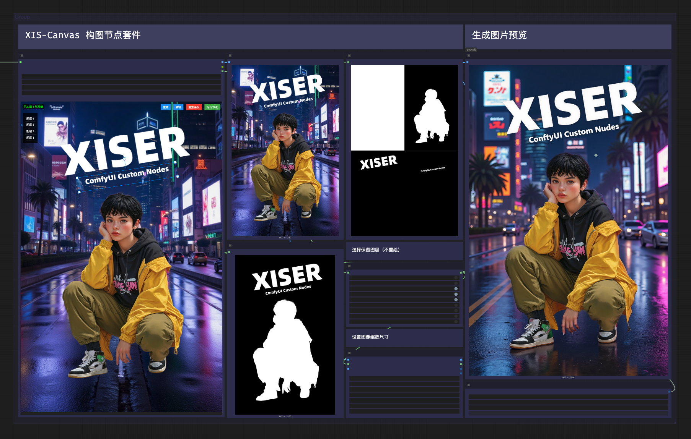

# ComfyUI_XISER_Nodes

Welcome to **ComfyUI_XISER_Nodes**, a custom node package for [ComfyUI](https://github.com/comfyanonymous/ComfyUI). This custom node provides efficient composition tools that can place images in layers on the drawing board, edit the images in the layers, and output the merged image and layer masks. It also includes some efficiency - enhancing image and mask processing, prompt editing, logic processing, UI controls, dynamic sampling, etc.

---

## Introduction to Nodes and Their Functions



XISER_Canvas 是 ComfyUI 中的一个强大扩展节点，旨在提供交互式画布功能，方便用户在工作流中进行图像编辑与管理。用户可以通过设置画布宽高（board_width、board_height）和边框尺寸（border_width），自定义画布大小，并选择背景颜色（canvas_color）。节点支持加载多张图像，显示在画布上，用户可通过拖动、缩放、旋转等操作调整图像位置与大小，同时支持图层管理，选择和切换不同图层以进行精细编辑。画布边界线框始终显示在图层之上，确保视觉清晰。此外，节点提供撤销、重做功能，方便操作回溯；通过“运行节点”按钮可触发工作流更新，“重置画板”则快速恢复初始状态。XISER_Canvas 适用于需要直观图像布局与编辑的场景，提升工作流效率。

XISER_Canvas 画板拓展功能节点：

- **XIS_ImagesToCanvas**：通过配套图像打包节点可以同时添加不同尺寸的RGB以及RGBA图像；
- **XIS_CanvasMaskProcessor**：接收画板输出的蒙版列表，可以自由选择合并指定图层蒙版。

XISER_Canvas is a powerful extension node in ComfyUI, designed to provide an interactive canvas function, facilitating image editing and management within workflows. Users can customize the canvas size by setting board_width, board_height, and border_width, and select a background color via canvas_color. The node supports loading multiple images onto the canvas, allowing users to adjust their position, size, and rotation through drag, zoom, and rotate actions, while also offering layer management to select and switch between layers for precise editing. The canvas border frame is always displayed above the layers, ensuring clear visibility. Additionally, the node provides undo/redo functionality for easy operation rollback, a "Run Node" button to trigger workflow updates, and a "Reset Canvas" option to quickly restore the initial state. XISER_Canvas is ideal for scenarios requiring intuitive image layout and editing, enhancing workflow efficiency.

XISER_Canvas Canvas Extension Features:

- **XIS_ImagesToCanvas**: With the companion image packing node, it allows simultaneous addition of RGB and RGBA images of different sizes.
- **XIS_CanvasMaskProcessor**: Accepts the mask list output from the canvas, enabling free selection and merging of specified layer masks.

---

## Installation

To get started, follow these steps:

1. Clone this repository into the `custom_nodes` directory of your ComfyUI installation:
   ```bash
   git clone https://github.com/grinlau18/ComfyUI_XISER_Nodes.git
   ```
2. Restart ComfyUI to load the new nodes.
3. Look for nodes under the `XISER_Nodes` category in the ComfyUI interface.

**Dependencies**: Requires `torch`, `PIL`, `numpy`, `opencv-python`, and ComfyUI core libraries (typically installed with ComfyUI).

---

## More Node Overview

Nodes are organized into categories based on their functionality:

- **Image & Mask Processing**: Tools for stitching, resizing, cropping, flipping, and compositing images and masks.
- **Logic Processing**: Nodes for handling conditional logic and data validation.
- **UI Control**: Interactive components like sliders and prompt switches.
- **List Processing**: Utilities for working with lists of various data types.
- **Other Processing**: Miscellaneous tools for compositing, sampling settings, and prompt handling.

Below is a detailed breakdown of each node, including its purpose and a practical example.

---

## Detailed Node Descriptions

### Image & Mask Processing

#### XIS_ImageStitcher
- **Purpose**: Stitches a main image with up to four sub-images into a single output, with customizable layout (vertical/horizontal), main image position (front/back), background color, and border size.
- **Inputs**: Main image (required), up to 4 sub-images (optional), layout, position, background color (HEX), border size.
- **Outputs**: Stitched image.
- **Example**:
  - **Scenario**: Create a travel photo collage for Instagram.
  - **Inputs**: Main image (1920x1080 mountain view), 3 sub-images (640x480: food, temple, local person), vertical layout, main image at top, `#D3D3D3` background, 20px border.
  - **Output**: A vertical collage (1920x3160) with the mountain view on top and sub-images below, separated by 20px gray borders.
- **Use Case**: Ideal for photo albums, social media posts, or multi-image presentations.

#### XIS_ResizeToDivisible
- **Purpose**: Resizes an image or mask to the nearest dimensions divisible by a specified number, ensuring compatibility with models requiring specific sizes.
- **Inputs**: Divisor (e.g., 64), image or mask (optional).
- **Outputs**: Resized image, resized mask.
- **Example**:
  - **Scenario**: Prepare an image for Stable Diffusion, which requires dimensions divisible by 64.
  - **Inputs**: Image (500x700), divisor = 64.
  - **Output**: Resized image (512x704).
- **Use Case**: Preprocessing for AI models like diffusion or super-resolution.

#### XIS_CropImage
- **Purpose**: Crops an image using a mask to isolate regions, with options to invert the mask and fill the background with a color.
- **Inputs**: Image, mask (optional), invert mask (boolean), background color (HEX), padding width.
- **Outputs**: Cropped image.
- **Example**:
  - **Scenario**: Remove a cluttered background from a portrait for a clean avatar.
  - **Inputs**: Image (800x600 portrait), mask (white = person, black = background), invert mask = false, `#FFFFFF` background.
  - **Output**: Cropped image with only the person, white background.
- **Use Case**: Background removal, product photography, or focusing on specific elements.

#### XIS_InvertMask
- **Purpose**: Inverts a mask’s values (0 to 1, 1 to 0).
- **Inputs**: Mask, invert (boolean), optional image for reference.
- **Outputs**: Inverted mask.
- **Example**:
  - **Scenario**: Apply a blur effect to the background instead of the subject (a cat).
  - **Inputs**: Mask (white = cat, black = background), invert = true.
  - **Output**: Inverted mask (white = background, black = cat).
- **Use Case**: Switching focus in image editing (e.g., background vs. foreground effects).

#### XIS_ImageMaskMirror
- **Purpose**: Flips an image and/or mask along the X or Y axis.
- **Inputs**: Flip axis (X/Y), enable flip (boolean), image or mask (optional).
- **Outputs**: Flipped image, flipped mask.
- **Example**:
  - **Scenario**: Augment training data for a dog detection model.
  - **Inputs**: Image (1024x768 dog), mask (dog outline), flip axis = X, enable = true.
  - **Output**: Horizontally flipped image and mask.
- **Use Case**: Data augmentation, symmetry design, or correcting orientation.

#### XIS_ResizeImageOrMask
- **Purpose**: Resizes an image or mask with modes like force resize or proportional scaling, using various interpolation methods.
- **Inputs**: Resize mode, scale condition, interpolation, min unit, image/mask, reference image or manual dimensions, fill color.
- **Outputs**: Resized image, resized mask, width, height.
- **Example**:
  - **Scenario**: Optimize a high-res image for web display.
  - **Inputs**: Image (2000x1500), mode = proportional, target width = 800, bilinear interpolation.
  - **Output**: Resized image (800x600).
- **Use Case**: Web optimization, model input preparation, or canvas fitting.

#### XIS_ReorderImageMaskGroups
- **Purpose**: Reorders groups of image-mask pairs, inserting a new pair at a specified position.
- **Inputs**: Insert order, insert image/mask, up to 4 existing image-mask pairs.
- **Outputs**: 5 reordered image-mask pairs.
- **Example**:
  - **Scenario**: Insert a plant image into a sequence of landscape, animal, and human images.
  - **Inputs**: Existing pairs (landscape, animal, human), new pair (plant), insert order = 2.
  - **Output**: Landscape, plant, animal, human, None.
- **Use Case**: Adjusting batch processing order or prioritizing specific edits.

#### XIS_MaskCompositeOperation
- **Purpose**: Combines masks with operations (add, subtract, intersect), supports blur, morphological ops, and color overlay.
- **Inputs**: Mask1, operation, blur radius, expand/shrink, invert, overlay color, opacity, mask2, reference image.
- **Outputs**: Result mask, overlay image.
- **Example**:
  - **Scenario**: Highlight overlapping sky and cloud regions in a photo.
  - **Inputs**: Mask1 (sky), mask2 (clouds), operation = intersect, blur = 3.0, overlay = `#0000FF`, opacity = 0.5.
  - **Output**: Mask of overlapping area, image with blue overlay.
- **Use Case**: Segmentation, special effects, or annotation.

### Logic Processing

#### XIS_IsThereAnyData
- **Purpose**: Outputs an input signal (int, float, boolean) if present, or a default value if absent.
- **Inputs**: Default int/float/boolean, optional int/float/boolean inputs.
- **Outputs**: Int, float, boolean.
- **Example**:
  - **Scenario**: Ensure a generation workflow has a default iteration count.
  - **Inputs**: Default int = 10, no int input connected.
  - **Output**: 10 (int).
- **Use Case**: Robust workflows with optional parameters.

#### XIS_IfDataIsNone
- **Purpose**: Checks if input is null, outputs a value based on type or a default.
- **Inputs**: Data type, default value, optional signal.
- **Outputs**: Is not null (boolean), int/float/boolean/string output.
- **Example**:
  - **Scenario**: Provide a fallback description if no text is entered.
  - **Inputs**: Type = STRING, default = "Default Description", signal = None.
  - **Output**: False, "Default Description" (string).
- **Use Case**: Handling user input or script fallbacks.

### UI Control

#### XIS_PromptsWithSwitches
- **Purpose**: Combines multiple prompts with enable/disable switches.
- **Inputs**: 5 prompt strings, 5 enable booleans.
- **Outputs**: Prompt list, enabled status.
- **Example**:
  - **Scenario**: Generate art with selective descriptors.
  - **Inputs**: Prompt1 = "forest" (enabled), Prompt2 = "night" (disabled), Prompt3 = "dreamy" (enabled).
  - **Output**: ["forest", "dreamy"], True.
- **Use Case**: Flexible prompt testing for generative AI.

### Other Processing

#### XIS_CompositorProcessor
- **Purpose**: Scales, rotates, and positions an image on a canvas with a background color.
- **Inputs**: Image, x/y coordinates, width/height, angle, canvas size, background color.
- **Outputs**: Processed image.
- **Example**:
  - **Scenario**: Create a poster with a rotated portrait.
  - **Inputs**: Image (800x600), canvas = 1200x800, `#0000FF`, scale to 400x300, rotate 30°, x=100, y=100.
  - **Output**: 1200x800 image with rotated portrait on blue background.
- **Use Case**: Poster design, image compositing.

---

## Contributing

Contributions are welcome! Feel free to:
- Submit pull requests with new features or bug fixes.
- Open issues for suggestions or problems.

## License

This project is licensed under the [MIT License](LICENSE).
