# ComfyUI_XISER_Nodes

<div align="center">

🌐 **Language Selection / 语言选择**

[**English Documentation**](README.md) • [**中文文档**](README_CN.md)

</div>

Welcome to **ComfyUI_XISER_Nodes**, a comprehensive custom node package for [ComfyUI](https://github.com/comfyanonymous/ComfyUI). This extension provides advanced visual editing capabilities including interactive multi-layer canvas with real-time transformations, professional PSD file import with layer extraction, versatile geometric shape generation with anti-aliased rendering, and sophisticated image processing tools. Features batch shape creation, mask manipulation, prompt management, data flow optimization, and workflow enhancement utilities for efficient AI image generation and editing workflows.

---

## Installation

**Install via ComfyUI's Manager**

1. Open the ComfyUI Manager
2. Search for `ComfyUI_XISER_Nodes` and install it

**Manual installation**

1. Clone this repository into the `custom_nodes` directory of your ComfyUI installation:
   ```bash
   git clone https://github.com/grinlau18/ComfyUI_XISER_Nodes.git
   ```
2. In the `ComfyUI_XISER_Nodes` directory, run:
   ```bash
   pip install -r requirements.txt
   ```
3. Restart ComfyUI to load the new nodes
4. Look for nodes under the `XISER_Nodes` category in the ComfyUI interface

**Dependencies**: Requires `torch`, `PIL`, `numpy`, `opencv-python`, and ComfyUI core libraries.

### Cutout Model Setup
The new cutout button in the canvas helper uses [BiRefNet](https://github.com/tamzi/bi-ref-net) to compute alpha masks. Follow these steps to activate it:

1. Download the `BiRefNet-general-epoch_244.pth` checkpoint and place it in `ComfyUI/models/BiRefNet/pth/`. You can retrieve the file from the official mirrors:
   - https://pan.baidu.com/s/12z3qUuqag3nqpN2NJ5pSzg?pwd=ek65
   - https://drive.google.com/drive/folders/1s2Xe0cjq-2ctnJBR24563yMSCOu4CcxM
2. Install the inference dependencies (if not already available) with `pip install kornia==0.7.2 timm` inside your ComfyUI environment.
3. Restart ComfyUI; the canvas cutout button will now call BiRefNet and preserve the trimmed result in both the UI and node outputs.

---


## Core Capabilities
- Multi-layer canvas editing with PSD import, BiRefNet cutouts, layer transformations, and mask-aware history.
- Visual toolkit comprising curve/path/gradient editors, ImageManager, shape/text generators, color controls, and label helpers.
- Image/mask/file utilities for blending, cropping, resizing, reordering, mirroring, and PSD layer handling.
- Data and workflow support through shape summaries, guard checks, shorthand serializers, list extractors, and divisible sizing.

### 🖼️ Multi-layer Canvas Hub (XIS_Canvas)
- **What makes it special**: the central visual playground for multi-layer composition, blending, and mask-aware editing.
- **Highlights**:
  - Drag, scale, rotate, hide/show, reorder, and fine-tune layers with real-time feedback plus mouse-wheel scaling and Alt+wheel rotation.
  - Configurable canvas size, borders, background, auto-sizing, and display scaling keep the workspace flexible while the 20-step undo/redo history protects changes.
  - BiRefNet-powered cutouts, automatic mask extraction, and PSD import with layer extraction feed downstream nodes without workarounds.
  - Custom scrollbars, scroll offset tracking, and the companion XIS_CanvasMaskProcessor keep long labels and mask outputs synced with every edit.

#### Node Interface
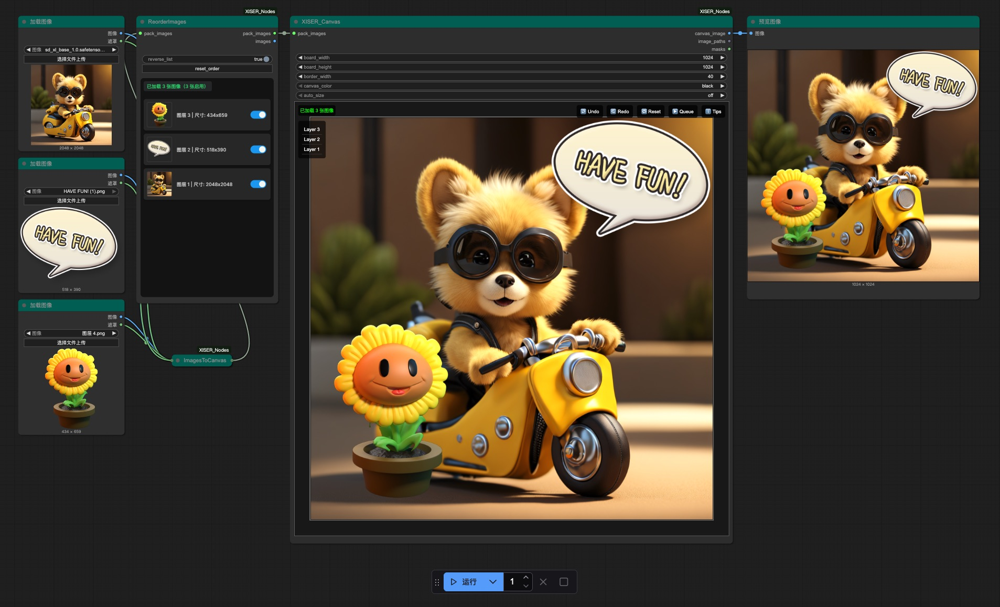
#### Workflow Example: Import PSD for Regional Redrawing
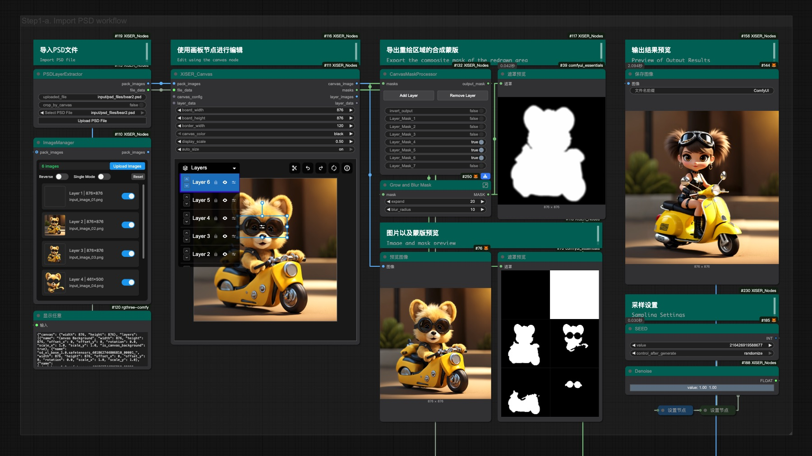
#### Workflow Example: Regional Redrawing After Image Layered Typesetting
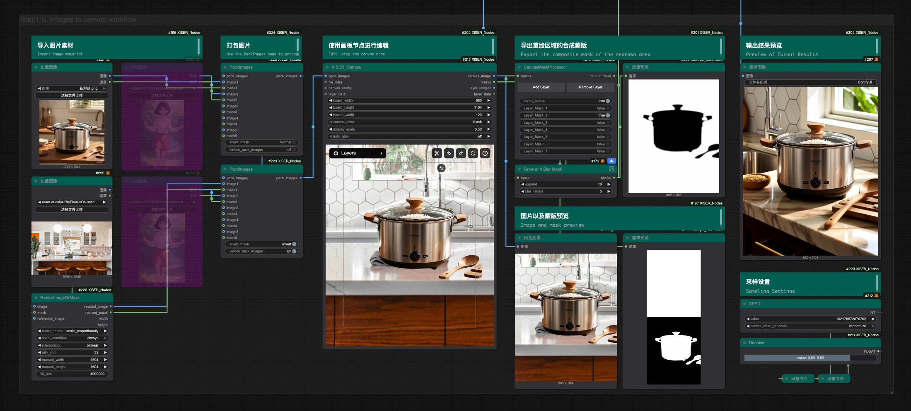

### ✨ Visual + Node Toolkit
- **XIS_CurveEditor**: Sculpt distribution curves for INT/FLOAT/HEX outputs, with a widget that exposes Bézier grips and HSV/RGB/LAB color interpolation.
  - Emits scalar sequences and optional colored lists so downstream nodes can hook into numeric ramps or palette cues.
  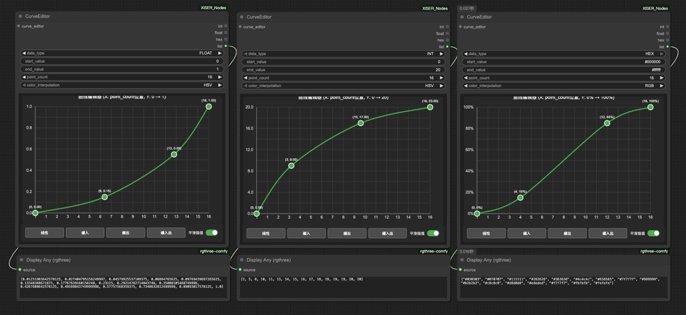  
  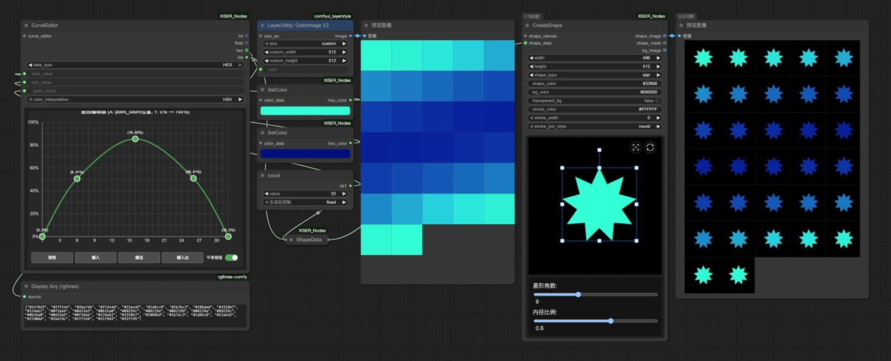
- **XIS_CoordinatePath**: Sketch linear or curved paths with configurable segments, distribution modes, and direct exports of x/y coordinates plus progress percentages.
  - Curve mode uses Catmull-Rom splines with virtual endpoints for smooth routing, while linear mode honors uniform or eased spacing.
  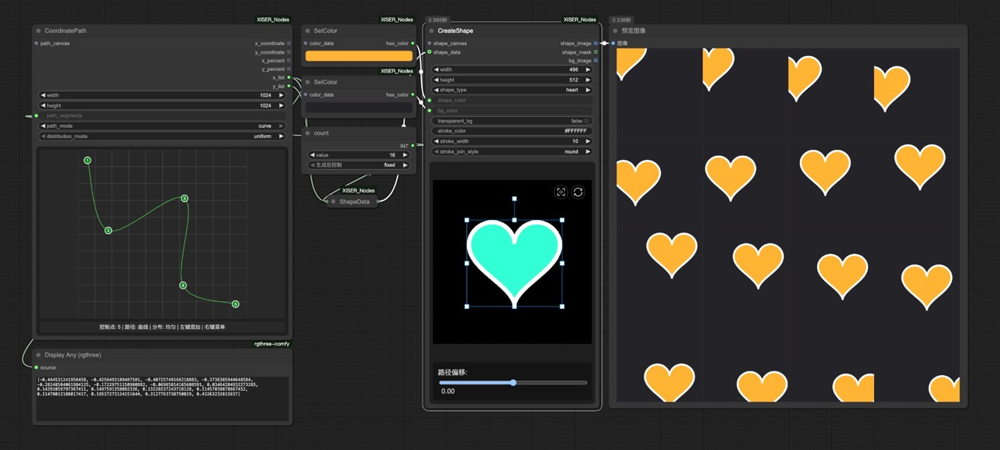
- **XIS_MultiPointGradient**: Generate gradient images from control points using IDW, radial, Voronoi, soft IDW, or linear interpolation.
  - Backend weights or Voronoi regions feed torch tensors that can be used as masks, backgrounds, or texture fills.
  
- **XIS_ImageManager**: Browse, cache, and reorder uploads before emitting the preview-aware `pack_images` output.
  - Tracks enabled layers, upload order, thumbnails, deterministic IDs, and metadata so downstream nodes see consistent image packs.
  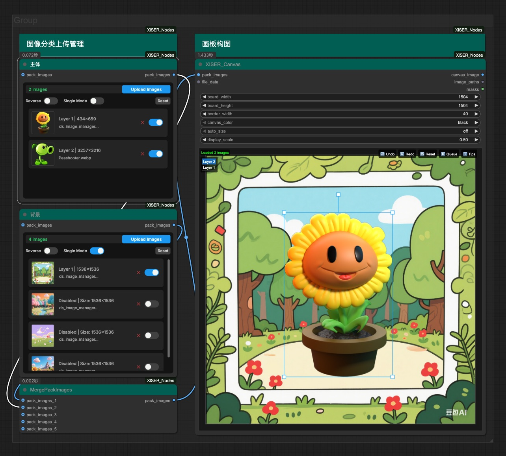
- **XIS_ShapeAndText**: Produce shape or text masks with configurable fill/stroke, transparency, and batch `shape_data` inputs; it returns the shape image, mask, and background.
  - Supports circles, polygons, stars, hearts, flowers, spirals, sunbursts, and text (with local font loading), plus spacing, stroke, transform, and skew controls.
  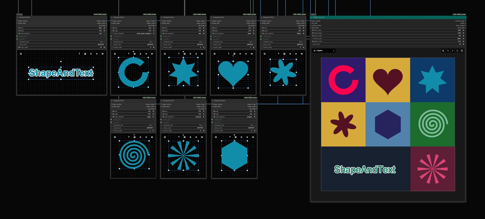  
  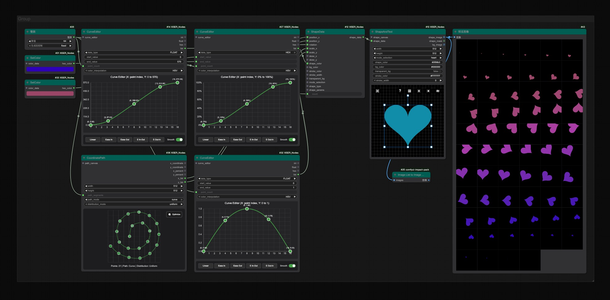
- **changeNodeColor**: Paint node titles and bodies independently to keep large graphs readable and visually organized.
  - Choose hex colors or presets, swap between title/body adjustments, and lock palettes for quick visual grouping.
  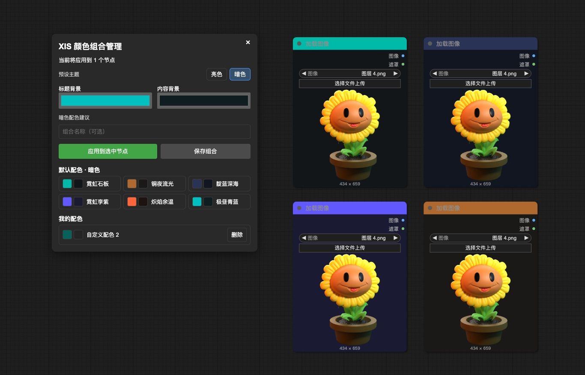  
- **XIS_Label**: Double-click to open HTML/Markdown editors (CodeMirror with textarea fallback), toggle editors, adjust backgrounds and text scale, and enjoy consistent spacing, list handling, markdown conversion, and smart scrollbars across languages.
  - Supports Markdown headings, lists, bold/italic, inline code, and links before rendering parsed nodes with normalized gaps and smart scrollbars.
  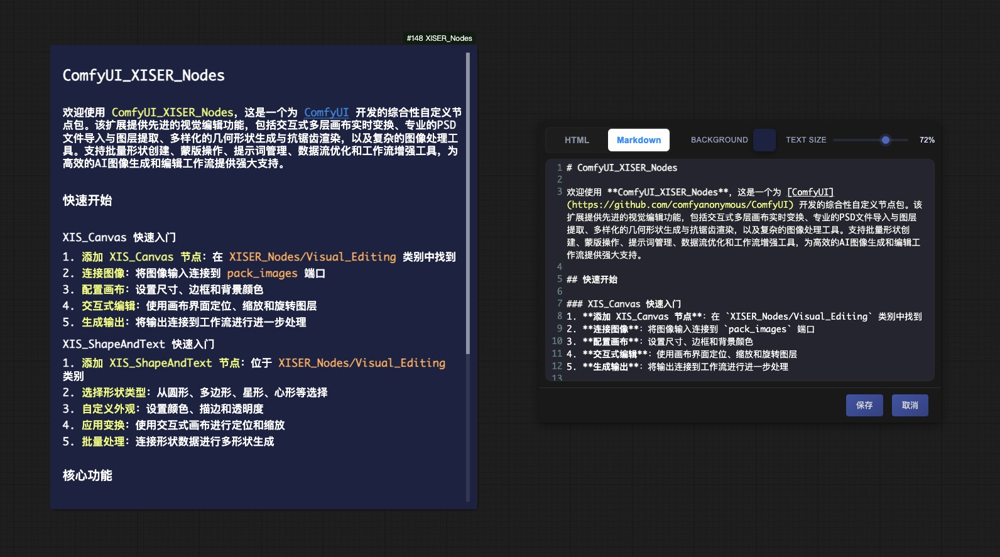
### 🧰 Image, Mask & File Nodes
- **XIS_ImageAdjustAndBlend**: Adjust brightness, contrast, saturation, hue, RGB gains, and blend modes with optional mask/background mixes.
- **XIS_CropImage**: Crop via masks, invert masks on demand, and fill backgrounds with color or padding.
- **XIS_ResizeImageOrMask**: Resize with multiple strategies (force, aspect ratio, canvas limit) plus interpolation choices and shrink/expand toggles.
- **XIS_ReorderImageMaskGroups**: Reorder or insert up to five image-mask pairs so compositing stays precise.
- **XIS_InvertMask**: Swap mask polarity quickly with a toggle.
- **XIS_ImageMaskMirror**: Mirror image/mask sets along X or Y axes to keep symmetric compositions aligned.
- **PSD Layer Extract** / **XIS_ReorderImages**: Pull layers out of PSDs and rearrange batches for downstream blending.

### ⚙️ Data & Utility Helpers
- **XIS_ShapeData**: Gather shape properties (position, rotation, scale, skew, color) for predictive pipelines.
- **XIS_IsThereAnyData**: Guard inputs across ints, floats, booleans, and supply fallbacks when signals are missing.
- **CreatePointsString**: Encode six frame/intensity pairs into a keyword-friendly shorthand for repeatable sequences.
- **XIS_FromListGet1…**: Extract single masks, images, latents, conditioning, models, colors, strings, ints, or floats from lists.
- **XIS_ResizeToDivisible**: Snap dimensions to the nearest divisible grid for downstream requirements.

---

## Acknowledgements

- The interactive canvas uses [Konva](https://konvajs.org/) under the hood; thanks to the Konva contributors for the full-featured 2D drawing API.
- The one-click cutout leverages [BiRefNet](https://github.com/tamzi/bi-ref-net) (thanks to the original authors and the community contributions such as the tin2tin/2D_Asset_Generator project) along with `kornia` and `timm` for the preprocessing/backbone support.
- Any additional inspiration for layer handling came from community-built ComfyUI extensions—big thanks to the ComfyUI and custom node author communities for keeping the ecosystem so vibrant.
- **Features**:
  - Boolean switch control support
  - Automatic value range handling

#### XIS_ImageMaskMirror
- **Function**: Image and mask mirror flipping
- **Features**:
  - Support for X-axis and Y-axis flipping
  - Enable/disable flip operations

### 📁 File Processing Nodes

#### PSD Layer Extract
- **Function**: PSD layer extraction
- **Features**:
  - Extract layers from PSD files
  - Support for layer masks and transparency

#### XIS_ReorderImages
- **Function**: Image reordering
- **Features**:
  - Rearrange images based on specified order
  - Support for batch image processing

---

## Usage Guide

### XIS_Canvas Operation Guide

**Layer Selection & Transformation:**
- **Select Layer**: Click on any image layer to select it
- **Move**: Drag selected layers to reposition
- **Scale**: Use control box handles or mouse wheel for precise scaling
- **Rotate**: Use Alt + mouse wheel or control box rotation handle
- **Independent Scaling**: Scale X and Y axes independently using corner handles

**Layer Management:**
- **Layer Panel**: Use the collapsible layer panel in top-left for layer selection
- **Auto Top**: Selected layers are automatically brought to top
- **Deselect**: Click on canvas background to deselect and restore original order

**Canvas Controls:**
- **Auto Size**: Enable to automatically adjust canvas to first image dimensions
- **Display Scale**: Adjust canvas display size without affecting output
- **Border Width**: Configure border size around canvas (default: 80px)
- **Canvas Color**: Choose canvas background color (black, white, transparent)

**Advanced Features:**
- **Undo/Redo**: 20-step history for all transformations
- **Reset Canvas**: Center all images and restore default states
- **PSD Import**: Import PSD files with layer extraction
- **Real-time Preview**: See transformations immediately

### XIS_ShapeAndText Operation Guide

**Shape Creation:**
- **Shape Types**: Circle / sector / doughnut, polygon (supports rounded corners), star, heart, flower, spiral, sunburst, text
- **Interactive Canvas**: Real-time preview with interactive widget
- **Batch Processing**: Create multiple shapes with shape data input

**Transformations:**
- **Position**: Normalized positioning relative to canvas center
- **Rotation**: Angle rotation in degrees
- **Scaling**: Independent X and Y axis scaling
- **Skewing**: Horizontal and vertical skew transformations

**Styling:**
- **Colors**: Configurable shape and background colors
- **Stroke**: Customizable stroke width, color, and join style
- **Transparency**: Transparent background options

---

## Workflow Examples

### Image Composition Workflow
Using XIS_Canvas and related nodes for image composition:
1. Load images using XIS_ImageManager
2. Layout and edit through XIS_Canvas
3. Process masks with XIS_CanvasMaskProcessor
4. Output composite results

### Visual Editing Workflow
Using visual editing nodes:
1. Generate coordinate paths with XIS_CoordinatePath
2. Create distribution curves with XIS_CurveEditor
3. Generate gradients with XIS_MultiPointGradient
4. Create geometric shapes with XIS_ShapeAndText

---

## Contact & Resources

**Workflow Sharing**
https://openart.ai/workflows/profile/grinlau?tab=workflows&sort=latest

**Bilibili Space**
https://space.bilibili.com/123365258

**Contact**
QQ: 3861103314
Email: grinlau18@gmail.com

---

## Contributing

Contributions are welcome! Feel free to:
- Submit pull requests with new features or bug fixes
- Open issues for suggestions or problems

## License

This project is licensed under the [MIT License](LICENSE).

---
