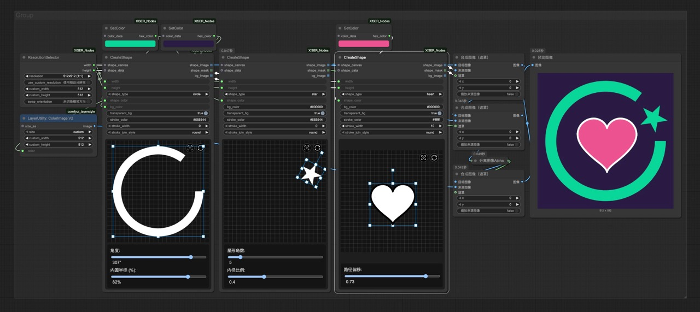
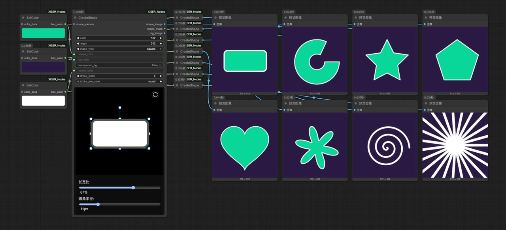

# ComfyUI_XISER_Nodes

<div align="center">

🌐 **Language Selection / 语言选择**

[**English Documentation**](README.md) • [**中文文档**](README_CN.md)

</div>

Welcome to **ComfyUI_XISER_Nodes**, a comprehensive custom node package for [ComfyUI](https://github.com/comfyanonymous/ComfyUI). This extension provides advanced visual editing capabilities including interactive multi-layer canvas with real-time transformations, professional PSD file import with layer extraction, versatile geometric shape generation with anti-aliased rendering, and sophisticated image processing tools. Features batch shape creation, mask manipulation, prompt management, data flow optimization, and workflow enhancement utilities for efficient AI image generation and editing workflows.

---

## Quick Start

### Getting Started with XIS_Canvas
1. **Add XIS_Canvas Node**: Find it under `XISER_Nodes/Visual_Editing` category
2. **Connect Images**: Connect your image inputs to the `pack_images` port
3. **Configure Canvas**: Set dimensions, border, and background color
4. **Interactive Editing**: Use the canvas interface to position, scale, and rotate layers
5. **Generate Output**: Connect the output to your workflow for further processing

### Getting Started with XIS_CreateShape
1. **Add XIS_CreateShape Node**: Located in `XISER_Nodes/Visual_Editing`
2. **Choose Shape Type**: Select from circle, polygon, star, heart, etc.
3. **Customize Appearance**: Set colors, stroke, and transparency
4. **Apply Transformations**: Use the interactive canvas for positioning and scaling
5. **Batch Processing**: Connect shape data for multiple shape generation

---

## Installation

**Install via ComfyUI's Manager**

1. Open the ComfyUI Manager
2. Search for `ComfyUI_XISER_Nodes` and install it

**Manual installation**

1. Clone this repository into the `custom_nodes` directory of your ComfyUI installation:
   ```bash
   git clone https://github.com/grinlau18/ComfyUI_XISER_Nodes.git
   ```
2. In the `ComfyUI_XISER_Nodes` directory, run:
   ```bash
   pip install -r requirements.txt
   ```
3. Restart ComfyUI to load the new nodes
4. Look for nodes under the `XISER_Nodes` category in the ComfyUI interface

**Dependencies**: Requires `torch`, `PIL`, `numpy`, `opencv-python`, and ComfyUI core libraries.

---

## Key Features

### 🎨 Advanced Visual Editing
- **Interactive Canvas**: Multi-layer image editing with real-time transformations
- **Shape Generation**: Create geometric shapes with advanced transformations
- **Gradient Tools**: Multi-point gradient generation with various interpolation methods

### 🔧 Professional Workflow Tools
- **PSD Import**: Professional PSD file import with layer extraction
- **Image Processing**: Advanced image adjustment, cropping, and resizing
- **Data Management**: Efficient data flow optimization and list processing

### 🎛️ User Experience
- **Intuitive UI**: Collapsible panels, real-time previews, and interactive controls
- **Customization**: Node color customization and HTML text labels
- **History Management**: 20-step undo/redo functionality

---

## Node Categories Overview

### 🎨 Visual Editing Nodes

#### XIS_Canvas (Canvas System)
- **Function**: Interactive canvas system supporting multi-layer image management and editing
- **Features**:
  - Customizable canvas dimensions, borders, and background colors
  - Drag, scale, and rotate image operations with real-time preview
  - Layer management with automatic top positioning and stacking order
  - Mask generation for precise image compositing
  - Undo/Redo functionality with 20-step history
  - Auto-size feature to match canvas dimensions to first image
  - Display scaling for better workflow visibility
  - PSD file import support with layer extraction
  - Real-time transformation controls with independent scaling
  - Mouse wheel scaling and Alt+wheel rotation for precise control


#### XIS_CoordinatePath
- **Function**: Generate coordinate paths based on control points
- **Features**:
  - Support for linear and curve path modes
  - Configurable path segments and distribution patterns
  - Output coordinate lists and percentage values


#### XIS_CurveEditor
- **Function**: Visual curve editor for generating distribution values
- **Features**:
  - Support for INT, FLOAT, HEX data types
  - Multiple interpolation methods
  - Color interpolation with HSV, RGB, LAB modes


#### XIS_MultiPointGradient
- **Function**: Generate gradient images based on control points
- **Features**:
  - Multiple interpolation methods (IDW, radial, Voronoi, etc.)
  - Linear mode with fixed start and end points
  - Customizable gradient colors and positions


#### XIS_CreateShape
- **Function**: Generate geometric shapes with interactive controls
- **Features**:
  - Multiple shape types: circle, polygon, star, heart, flower, spiral, sunburst, square
  - Configurable colors, stroke, transparency, and background
  - Advanced transformations: rotation, scaling, skewing, positioning
  - Batch shape creation with shape data input
  - Anti-aliased rendering for smooth edges
  - Separate shape image, mask, and background outputs
  - Real-time preview with interactive canvas widget




### 🖼️ Image Processing Nodes

#### XIS_ImageManager
- **Function**: Image manager for handling image input, upload, and preview
- **Features**:
  - Image preview generation and path management
  - Support for multiple image inputs and outputs
  - Automatic cache management


#### XIS_ImageAdjustAndBlend
- **Function**: Image adjustment and blending
- **Features**:
  - Brightness, contrast, saturation, hue adjustments
  - RGB channel gain control
  - Support for masks and background images
  - Multiple blending modes

#### XIS_CropImage
- **Function**: Crop images using masks
- **Features**:
  - Support for mask inversion
  - Background color filling
  - Configurable padding margins

#### XIS_ResizeImageOrMask
- **Function**: Flexible image and mask resizing
- **Features**:
  - Multiple resize modes (force resize, aspect ratio, canvas limit, etc.)
  - Support for various interpolation algorithms
  - Configurable resize conditions (only shrink, only enlarge, always resize)

#### XIS_ReorderImageMaskGroups
- **Function**: Reorder image and mask groups
- **Features**:
  - Support for insertion and reordering
  - Handles up to 5 image-mask pairs

### 📊 Data Processing Nodes

#### XIS_ShapeData
- **Function**: Aggregate shape property data
- **Features**:
  - Support for position, rotation, scaling, skewing, color properties
  - Multi-input port data merging
  - Property counting and processing

#### XIS_IsThereAnyData
- **Function**: Data existence checking
- **Features**:
  - Check if input signals exist
  - Support for integers, floats, boolean values
  - Return default values when no input is provided

#### XIS_FromListGet1* Series
- **Function**: Extract single elements from lists
- **Supported Types**: Mask, Image, Latent, Conditioning, Model, Color, String, Int, Float

### 🎛️ UI Control Nodes

#### XIS_PromptsWithSwitches
- **Function**: Prompt input with switch controls
- **Features**:
  - Support for up to 5 prompts
  - Independent switch control for each prompt
  - Output enabled prompt lists

#### XIS_Float_Slider / XIS_INT_Slider
- **Function**: Slider numerical input
- **Features**:
  - Float and integer sliders
  - Configurable ranges and step sizes

### 🔧 Utility Nodes

#### XIS_ResizeToDivisible
- **Function**: Resize to divisible dimensions
- **Features**:
  - Automatically calculate closest divisible dimensions
  - Support for images and masks

#### XIS_InvertMask
- **Function**: Mask inversion
- **Features**:
  - Boolean switch control support
  - Automatic value range handling

#### XIS_ImageMaskMirror
- **Function**: Image and mask mirror flipping
- **Features**:
  - Support for X-axis and Y-axis flipping
  - Enable/disable flip operations

### 📁 File Processing Nodes

#### PSD Layer Extract
- **Function**: PSD layer extraction
- **Features**:
  - Extract layers from PSD files
  - Support for layer masks and transparency

#### XIS_ReorderImages
- **Function**: Image reordering
- **Features**:
  - Rearrange images based on specified order
  - Support for batch image processing

---

## Special Features

### Node Color Customization
- **Function**: Node color customization
- **Usage**: Right-click on node, select "Change Node Color"
- **Features**: Modify background colors for node title and content areas separately


### Text Label with HTML Support
- **Function**: Text labels with HTML support
- **Usage**: Right-click above node, select "Edit Text"
- **Features**: Input text and set styles using HTML language


---

## Usage Guide

### XIS_Canvas Operation Guide

**Layer Selection & Transformation:**
- **Select Layer**: Click on any image layer to select it
- **Move**: Drag selected layers to reposition
- **Scale**: Use control box handles or mouse wheel for precise scaling
- **Rotate**: Use Alt + mouse wheel or control box rotation handle
- **Independent Scaling**: Scale X and Y axes independently using corner handles

**Layer Management:**
- **Layer Panel**: Use the collapsible layer panel in top-left for layer selection
- **Auto Top**: Selected layers are automatically brought to top
- **Deselect**: Click on canvas background to deselect and restore original order

**Canvas Controls:**
- **Auto Size**: Enable to automatically adjust canvas to first image dimensions
- **Display Scale**: Adjust canvas display size without affecting output
- **Border Width**: Configure border size around canvas (default: 80px)
- **Canvas Color**: Choose canvas background color (black, white, transparent)

**Advanced Features:**
- **Undo/Redo**: 20-step history for all transformations
- **Reset Canvas**: Center all images and restore default states
- **PSD Import**: Import PSD files with layer extraction
- **Real-time Preview**: See transformations immediately

### XIS_CreateShape Operation Guide

**Shape Creation:**
- **Shape Types**: Circle, polygon, star, heart, flower, spiral, sunburst, square
- **Interactive Canvas**: Real-time preview with interactive widget
- **Batch Processing**: Create multiple shapes with shape data input

**Transformations:**
- **Position**: Normalized positioning relative to canvas center
- **Rotation**: Angle rotation in degrees
- **Scaling**: Independent X and Y axis scaling
- **Skewing**: Horizontal and vertical skew transformations

**Styling:**
- **Colors**: Configurable shape and background colors
- **Stroke**: Customizable stroke width, color, and join style
- **Transparency**: Transparent background options

---

## Workflow Examples

### Image Composition Workflow
Using XIS_Canvas and related nodes for image composition:
1. Load images using XIS_ImageManager
2. Layout and edit through XIS_Canvas
3. Process masks with XIS_CanvasMaskProcessor
4. Output composite results

### Visual Editing Workflow
Using visual editing nodes:
1. Generate coordinate paths with XIS_CoordinatePath
2. Create distribution curves with XIS_CurveEditor
3. Generate gradients with XIS_MultiPointGradient
4. Create geometric shapes with XIS_CreateShape

---

## Contact & Resources

**Workflow Sharing**
https://openart.ai/workflows/profile/grinlau?tab=workflows&sort=latest

**Bilibili Space**
https://space.bilibili.com/123365258

**Contact**
QQ: 3861103314
Email: grinlau18@gmail.com

---

## Contributing

Contributions are welcome! Feel free to:
- Submit pull requests with new features or bug fixes
- Open issues for suggestions or problems

## License

This project is licensed under the [MIT License](LICENSE).

---