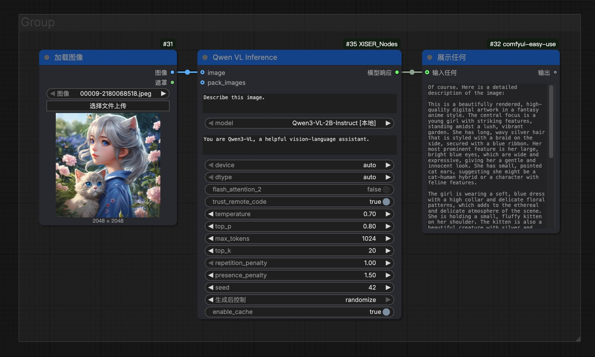
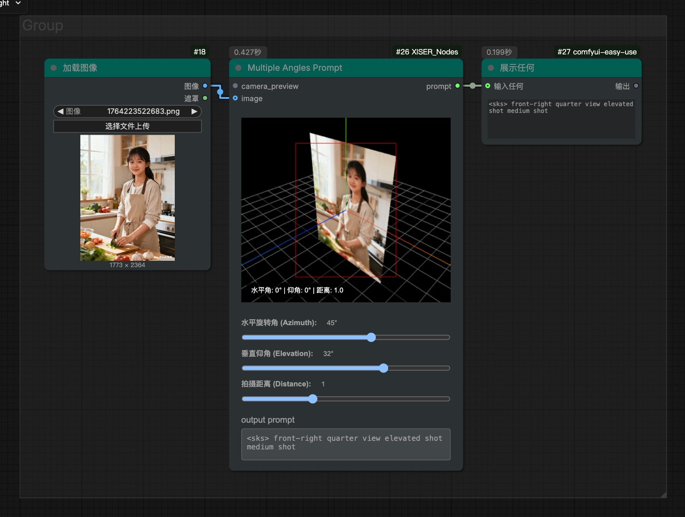

# ComfyUI_XISER_Nodes

<div align="center">

🌐 **Language Selection / 语言选择**

[**English Documentation**](README.md) • [**中文文档**](README_CN.md)

</div>

## 📢 Latest Updates (January 2026)

- **[Update Summary](UPDATE_SUMMARY_2026.md)** - Complete update content and migration guide

### January 2026 Updates
✅ **V3 Architecture Migration** - Backend fully adopts ComfyUI's latest API standard
✅ **3 New Core Nodes** - `image preview`, `dynamic pack images`, `dynamic image inputs`
✅ **Redundant Node Removal** - Removed `reorder images` node overlapping with `image manager` functionality
✅ **LLM Orchestrator Enhancement** - Added Wan 2.6 model support with image editing and interleave mode
✅ **VGM Orchestrator Introduction** - New video generation orchestrator node supporting reference-based video, image-to-video, and keyframe-to-video modes
✅ **Performance Optimization** - Improved node interaction and system performance
✅ **New Qwen VL Inference Node** - Local Qwen3-VL vision-language model for image analysis and reasoning
✅ **New Multiple Angles Prompt Node** - Visual interface for generating camera angle prompts with 3D preview

---

Welcome to **ComfyUI_XISER_Nodes**, a comprehensive custom node package built on the **ComfyUI V3 architecture**.
This extension integrates interactive multi-layer canvas editing, multimodal LLM intelligent processing (supporting mainstream models like DeepSeek, Qwen, Kimi, Wan), professional-grade image processing toolchains, video generation orchestration systems (supporting Wansiang series reference-based video, image-to-video, and keyframe-to-video generation), and visual data tools, providing end-to-end support for AI image and video generation workflows from creative conception to fine editing. With advanced PSD import, BiRefNet intelligent matting, real-time layer transformations, unified configuration-based video generation orchestration, and secure API key management, it significantly enhances creative efficiency and output quality. Additionally, it offers workflow customization features like node color management and label nodes to improve visual organization and personalization of complex workflows.

---

## Installation

**Install via ComfyUI's Manager**

1. Open the ComfyUI Manager
2. Search for `ComfyUI_XISER_Nodes` and install it

**Manual installation**

1. Clone this repository into the `custom_nodes` directory of your ComfyUI installation:
   ```bash
   git clone https://github.com/grinlau18/ComfyUI_XISER_Nodes.git
   ```
2. In the `ComfyUI_XISER_Nodes` directory, run:
   ```bash
   pip install -r requirements.txt
   ```
3. Restart ComfyUI to load the new nodes
4. Look for nodes under the `XISER_Nodes` category in the ComfyUI interface

**Dependencies**: Requires `torch`, `PIL`, `numpy`, `opencv-python`, and ComfyUI core libraries.

### Cutout Model Setup
The new cutout button in the canvas helper uses [BiRefNet](https://github.com/tamzi/bi-ref-net) to compute alpha masks. Follow these steps to activate it:

1. Download the `BiRefNet-general-epoch_244.pth` checkpoint and place it in `ComfyUI/models/BiRefNet/pth/`. You can retrieve the file from the official mirrors:
   - https://pan.baidu.com/s/12z3qUuqag3nqpN2NJ5pSzg?pwd=ek65
   - https://drive.google.com/drive/folders/1s2Xe0cjq-2ctnJBR24563yMSCOu4CcxM
2. Install the inference dependencies (if not already available) with `pip install kornia==0.7.2 timm` inside your ComfyUI environment.
3. Restart ComfyUI; the canvas cutout button will now call BiRefNet and preserve the trimmed result in both the UI and node outputs.

## Core Capabilities
- Multi-layer canvas editing with PSD import, BiRefNet cutouts, layer transformations, and mask-aware history.
- Visual node toolkit comprising curve/path/gradient editors, image management, shape/text generation, node coloring, and label helpers.
- Image/mask/file utilities for color adjustment, cropping, resizing, reordering, mirroring, and PSD layer handling.
- Data and workflow support including shape summaries, signal detection, shorthand serialization, list extraction, and divisible size correction.
- LLM automation powered by DeepSeek with an extensible provider interface ready for future models.
- Video generation orchestration supporting reference-based video, image-to-video, and keyframe-to-video modes with unified configuration system.

### 🖼️ Multi-layer Canvas Hub (XIS_Canvas)
- **Essence**: The central canvas integrating BiRefNet cutouts, PSD import, layer transformations, mask generation, transparency adjustment, and 20-step history.
- **Highlights**:
  - Drag, scale, rotate, hide/show, reorder layers with real-time preview, plus mouse-wheel scaling and Alt+wheel rotation.
  - Real-time adjustment of brightness, contrast, saturation, and transparency.
  - Customizable canvas size, borders, background, auto-sizing, display scaling, and custom scrollbars for smooth reading of long content.
  - BiRefNet cutouts, mask generation, and PSD multi-layer extraction seamlessly integrated, with XIS_CanvasMaskProcessor keeping masks synchronized with canvas state.
  - One-click output of trimmed results with transparent layers, eliminating manual cropping workflows.

#### Node Interface

#### Workflow Example: Import PSD for Regional Redrawing

#### Workflow Example: Regional Redrawing After Image Layered Typesetting


### 🤖 LLM Automation Bridge (XIS_LLMOrchestrator)
- **Purpose**: Route instructions plus optional `image`/`pack_images` tensors to a selected LLM provider (currently supports DeepSeek, Qwen series, Kimi models, Wan 2.6, with more to come) and emit the reply as a STRING output for downstream nodes.
- **Inputs**:
  - **Core Parameters** (always visible): Provider selection, instruction text, seed, image size, mode (for wan2.6)
  - **Advanced Parameters** (collapsible): Temperature, top-p, max tokens, negative prompt, watermark, prompt extend, etc.
  - **Vision Inputs**: Optional `image` (single) and `pack_images` (multiple) inputs
- **UI Optimization**:
  - **Collapsible Advanced Settings**: Infrequently used parameters are hidden by default, click "Show Advanced Settings" to expand
  - **Clean Interface**: Removed unused style and quality parameters for a cleaner user experience
  - **wan2.6 Mode Optimization**: Mode control always visible, watermark and prompt_extend moved to advanced settings
- **Attachment Processing**: Automatically converts all input images to PNG Base64 strings, truncating to the model's image limit for convenient multi-image requests.
- **Extensibility**: Providers register via lightweight config + interface, allowing new models or custom inference endpoints to be added without modifying node core logic.
- **Vision Input Support**:
  - **Qwen Series Vision Models**: Support image input and visual understanding, but do not generate images
  - **Qwen Image Generation Models**: Support image input and generate new images
  - **Wan 2.6 Image Model**: Support image editing and interleave mode
  - **DeepSeek Models**: Currently do not support image input. If images are connected, they will be automatically ignored with a warning message added to the prompt.
- **Wan 2.6 Image Editing**: New Wan 2.6 model support provides professional image editing capabilities with advanced parameters including image size adjustment, prompt extension, watermark control, and more.
- **Interleave Mode**: Wan 2.6 model supports interleave mode, allowing alternating text and image content processing within a single request for more flexible creative workflows.
- **API Key Management**:
  - **Secure Storage**: API Keys are encrypted and stored in the `ComfyUI/user/API_keys/` directory, never saved in workflow or project files
  - **Key Manager**: Click the "API key management" button on the node to open the key management interface
  - **Profiles**: Support for multiple API Key profiles, each node can independently select a profile
  - **Usage Flow**:
    1. Click "API key management" button to open the key manager
    2. Enter an API name in "API Name" and your API Key in "API Key"
    3. Click "Save" to store the encrypted API Key
    4. Select the desired profile from the "Select API key" dropdown
    5. The configuration will be automatically applied to the current node
  - **Note**: API Key profiles are node-specific, different nodes can use different API Keys
  
  
  

### 🔍 Qwen VL Inference Node (XIS_QwenVLInference)
- **Purpose**: Run Qwen3-VL vision-language models locally for image analysis and reasoning, supporting up to 8 image inputs.
- **Capabilities**: Image description, visual question answering, document understanding, OCR, etc., with full generation parameter control (temperature, top_p, max_tokens, etc.).
- **Features**: Automatic model directory scanning, support for Qwen3-VL series models, local inference without internet connection.
  

### 🎬 Video Generation Orchestrator (XIS_VGMOrchestrator)
- **Purpose**: Orchestrate video generation tasks across multiple providers and models, supporting reference-based video generation (r2v), image-to-video (i2v), and keyframe-to-video (kf2v) modes. Outputs video frames as image batches for seamless integration with ComfyUI's video processing pipeline.
- **Core Features**:
  - **Unified Configuration System**: All model configurations centralized in `config/video_models.yaml`, shared between frontend and backend
  - **Multiple Generation Modes**:
    - **Reference-based Video (r2v)**: Generate videos based on reference videos, preserving character appearance and voice characteristics
    - **Image-to-Video (i2v)**: Generate videos from first-frame images with audio input and intelligent prompt rewriting
    - **Keyframe-to-Video (kf2v)**: Generate videos from first and last frame images with special effects templates
  - **Dynamic UI**: Interface adapts based on selected model, showing/hiding relevant controls automatically
  - **Built-in Cache**: Intelligent caching system reduces redundant API calls and improves performance
  - **Progress Tracking**: Real-time progress updates during video generation tasks
- **Supported Models**:
  - **Reference-based Video (r2v)**:
    - `wan2.6-r2v`: Wansiang 2.6 reference-based video generation with audio support
  - **Image-to-Video (i2v)**:
    - `wan2.6-i2v`: Wansiang 2.6 image-to-video with multi-shot narrative capability
    - `wan2.6-i2v-flash`: Wansiang 2.6 image-to-video flash version (fast generation)
    - `wan2.5-i2v-preview`: Wansiang 2.5 image-to-video preview with audio support
    - `wan2.2-i2v-flash`: Wansiang 2.2 image-to-video flash version
    - `wan2.2-i2v-plus`: Wansiang 2.2 image-to-video professional version
    - `wanx2.1-i2v-plus`: Wansiang 2.1 image-to-video professional version
    - `wanx2.1-i2v-turbo`: Wansiang 2.1 image-to-video turbo version
  - **Keyframe-to-Video (kf2v)**:
    - `wan2.2-kf2v-flash`: Wansiang 2.2 keyframe-to-video flash version
    - `wanx2.1-kf2v-plus`: Wansiang 2.1 keyframe-to-video professional version
- **Inputs**:
  - **Core Parameters**: Model selection, prompt text, reference video URLs (for r2v), image inputs (for i2v/kf2v)
  - **Video Parameters**: Resolution (720P/1080P), duration (5/10/15 seconds), shot type (single/multi), watermark control
  - **Advanced Parameters**: Negative prompt, seed, prompt extension, template selection (for kf2v)
- **Outputs**:
  - **images**: Video frames converted to image batches, ready for direct connection to VideoCombine nodes
  - **video_url**: Original video URL from the generation service
  - **task_info**: Task information including task ID and API request details
- **API Key Management**:
  - **Secure Storage**: API Keys encrypted and stored in `ComfyUI/user/API_keys/` directory
  - **Key Manager**: Accessible via "API key management" button on the node
  - **Profile Support**: Multiple API Key profiles, each node can independently select a profile
  - **Usage Flow**:
    1. Click "API key management" button to open key manager
    2. Enter API name and API Key
    3. Click "Save" to store encrypted API Key
    4. Select desired profile from dropdown
    5. Configuration automatically applied to current node
- **Usage Example**:
  1. Select video generation model from dropdown (e.g., `wan2.6-i2v`)
  2. Configure API key via "API key management" button
  3. Input prompt describing desired video content
  4. For image-to-video: connect image input; for reference-based video: input reference video URLs
  5. Set resolution, duration, and other parameters
  6. Execute node to generate video
  7. Connect output `images` to VideoCombine node for video creation
  8. Use `video_url` for direct video download if needed
- **Note**: Detailed parameter descriptions available in tooltips for each control. The node automatically adapts its interface based on selected model type.
- **Screenshots**:
   *(Screenshot placeholder - add actual screenshot file)*
   *(Screenshot placeholder - add actual screenshot file)*

### ✨ Visual Node Toolkit
- **XIS_CurveEditor**: Sculpt distribution curves for INT/FLOAT/HEX outputs, with a widget that exposes Bézier grips and HSV/RGB/LAB color interpolation.
  - Emits scalar sequences and optional colored lists so downstream nodes can hook into numeric ramps or palette cues.
  
  
- **XIS_CoordinatePath**: Sketch linear or curved paths with configurable segments, distribution modes, and direct exports of x/y coordinates plus progress percentages.
  - Curve mode uses Catmull-Rom splines with virtual endpoints for smooth routing, while linear mode honors uniform or eased spacing.
  
- **XIS_MultiPointGradient**: Generate gradient images from control points using IDW, radial, Voronoi, soft IDW, or linear interpolation.
  - Backend weights or Voronoi regions feed torch tensors that can be used as masks, backgrounds, or texture fills.
  
- **XIS_ImageManager**: Browse, cache, and reorder uploads before emitting the preview-aware `pack_images` output.
  - Tracks enabled layers, upload order, thumbnails, deterministic IDs, and metadata so downstream nodes see consistent image packs.
  - **Image Editing**: Click on any preview image to open the built-in image editor for cropping and adjustments
  - **Visual Cues**: Hover over preview images to see a scissors icon indicating editing capability
  
  
- **XIS_ShapeAndText**: Produce shape or text masks with configurable fill/stroke, transparency, and batch `shape_data` inputs; it returns the shape image, mask, and background.
  - Supports circles, polygons, stars, hearts, flowers, spirals, sunbursts, and text (with local font loading), plus spacing, stroke, transform, and skew controls.
  
  
- **changeNodeColor**: Paint node titles and bodies independently to keep large graphs readable and visually organized.
  - **Access**: Right-click any node and select "XISER Node Color Manager" from the context menu
  - **Color Selection**: Choose hex colors via color picker or select from curated presets
  - **Dual Color Control**: Independently adjust title background and body background colors
  - **Theme Support**: Switch between light and dark theme presets
  - **Preset Management**: Save custom color combinations for reuse, delete unwanted presets
  - **Batch Operations**: Select multiple nodes to apply colors to all selected nodes simultaneously
  - **Real-time Preview**: Colors are applied immediately as you adjust them
  - **Persistent Storage**: Custom presets are saved to `web/xiser_color_presets.json`
  
  
- **XIS_Label**: Double-click to open HTML/Markdown editors (CodeMirror with textarea fallback), toggle editors, adjust backgrounds and text scale, and enjoy consistent spacing, list handling, markdown conversion, and smart scrollbars across languages.
  - Supports Markdown headings, lists, bold/italic, inline code, and links before rendering parsed nodes with normalized gaps and smart scrollbars.
  

- **XIS_MultipleAnglesPrompt**: Generate camera angle prompts through a visual interface with 3D preview and image reference support. Provides precise camera angle control for [Qwen-Image-Edit-2511-Multiple-Angles-LoRA models](https://huggingface.co/fal/Qwen-Image-Edit-2511-Multiple-Angles-LoRA).
  

### 🧰 Image, Mask & File Nodes
- **XIS_ImagePuzzle**: Advanced image stitching with four layout types (left-main, right-main, top-main, bottom-main), supporting multiple main images with proper spacing and alignment.
  
  
  
- **XIS_ImageAdjustAndBlend**: Adjust brightness, contrast, saturation, hue, RGB gains, and blend modes with optional mask/background mixes.
- **XIS_CropImage**: Crop via masks, invert masks on demand, and fill backgrounds with color or padding.
- **XIS_ResizeImageOrMask**: Resize with multiple strategies (force, aspect ratio, canvas limit) plus interpolation choices and shrink/expand toggles.
- **XIS_ReorderImageMaskGroups**: Reorder or insert up to five image-mask pairs so compositing stays precise.
- **XIS_InvertMask**: Swap mask polarity quickly with a toggle.
- **XIS_ImageMaskMirror**: Mirror image/mask sets along X or Y axes to keep symmetric compositions aligned.
- **PSD Layer Extract** / **XIS_ReorderImages**: Pull layers out of PSDs and rearrange batches for downstream blending.

### ⚙️ Data & Utility Helpers
- **XIS_ShapeData**: Gather shape properties (position, rotation, scale, skew, color) for predictive pipelines.
- **XIS_IsThereAnyData**: Guard inputs across ints, floats, booleans, and supply fallbacks when signals are missing.
- **CreatePointsString**: Encode six frame/intensity pairs into a keyword-friendly shorthand for repeatable sequences.
- **XIS_FromListGet1…**: Extract single masks, images, latents, conditioning, models, colors, strings, ints, or floats from lists.
- **XIS_ResizeToDivisible**: Snap dimensions to the nearest divisible grid for downstream requirements.

---

## Acknowledgements

- The interactive canvas uses [Konva](https://konvajs.org/) under the hood; thanks to the Konva contributors for the full-featured 2D drawing API.
- The one-click cutout leverages [BiRefNet](https://github.com/tamzi/bi-ref-net) (thanks to the original authors and the community contributions such as the tin2tin/2D_Asset_Generator project) along with `kornia` and `timm` for the preprocessing/backbone support.
- Any additional inspiration for layer handling came from community-built ComfyUI extensions—big thanks to the ComfyUI and custom node author communities for keeping the ecosystem so vibrant.

---

## Contact & Resources

**Workflow Sharing**
https://openart.ai/workflows/profile/grinlau?tab=workflows&sort=latest

**Bilibili Space**
https://space.bilibili.com/123365258

**Contact Information**
QQ: 3861103314
Email: grinlau18@gmail.com

---

## Contributing

Contributions are welcome! Feel free to:
- Submit pull requests with new features or bug fixes
- Open issues for suggestions or problems

## License

This project is licensed under the [MIT License](LICENSE).

---
