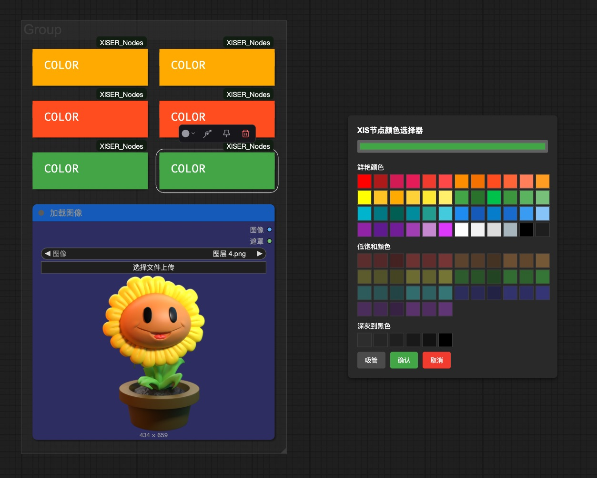

# ComfyUI_XISER_Nodes

Welcome to **ComfyUI_XISER_Nodes**, a custom node package for [ComfyUI](https://github.com/comfyanonymous/ComfyUI). This custom node provides efficient composition tools that can place images in layers on the drawing board, edit the images in the layers, and output the merged image and layer masks. It also includes some efficiency - enhancing image and mask processing, prompt editing, logic processing, UI controls, dynamic sampling, etc.

---

## Installation

**Install via ComfyUI's Manager**

1. Open the ComfyUI Manager.
2. Search for `ComfyUI_XISER_Nodes` and install it.

**Manual installation, follow these steps:**

1. Clone this repository into the `custom_nodes` directory of your ComfyUI installation:
   ```bash
   git clone https://github.com/grinlau18/ComfyUI_XISER_Nodes.git
   ```
2. In the `ComfyUI_XISER_Nodes` directory, run the following command:
   ```bash
   pip install -r requirements.txt
   ```
3. Restart ComfyUI to load the new nodes.
4. Look for nodes under the `XISER_Nodes` category in the ComfyUI interface.

**Dependencies**: Requires `torch`, `PIL`, `numpy`, `opencv-python`, and ComfyUI core libraries (typically installed with ComfyUI).

---

## XISER_Canvas Node Overview

XISER_Canvas is a powerful extension node in ComfyUI, designed to provide an interactive canvas function, facilitating image editing and management within workflows. Users can customize the canvas size by setting board_width, board_height, and border_width, and select a background color via canvas_color. The node supports loading multiple images onto the canvas, allowing users to adjust their position, size, and rotation through drag, zoom, and rotate actions, while also offering layer management to select and switch between layers for precise editing. The canvas border frame is always displayed above the layers, ensuring clear visibility. Additionally, the node provides undo/redo functionality for easy operation rollback, a "Run Node" button to trigger workflow updates, and a "Reset Canvas" option to quickly restore the initial state. XISER_Canvas is ideal for scenarios requiring intuitive image layout and editing, enhancing workflow efficiency.

XISER_Canvas 是 ComfyUI 中的一个强大扩展节点，旨在提供交互式画布功能，方便用户在工作流中进行图像编辑与管理。用户可以通过设置画布宽高（board_width、board_height）和边框尺寸（border_width），自定义画布大小，并选择背景颜色（canvas_color）。节点支持加载多张图像，显示在画布上，用户可通过拖动、缩放、旋转等操作调整图像位置与大小，同时支持图层管理，选择和切换不同图层以进行精细编辑。画布边界线框始终显示在图层之上，确保视觉清晰。此外，节点提供撤销、重做功能，方便操作回溯；通过“运行节点”按钮可触发工作流更新，“重置画板”则快速恢复初始状态。XISER_Canvas 适用于需要直观图像布局与编辑的场景，提升工作流效率。

XISER_Canvas Canvas Extension Features:

XISER_Canvas 画板拓展功能节点：

- **XIS_ImagesToCanvas**: With the companion image packing node, it allows simultaneous addition of RGB and RGBA images of different sizes.
- **XIS_ImagesToCanvas**：通过配套图像打包节点可以同时添加不同尺寸的RGB以及RGBA图像；
  
- **XIS_CanvasMaskProcessor**: Accepts the mask list output from the canvas, enabling free selection and merging of specified layer masks.
- **XIS_CanvasMaskProcessor**：接收画板输出的蒙版列表，可以自由选择合并指定图层蒙版。


**It supports the import of PSD files. You can directly import them into the artboard after dividing the layers in Photoshop.**

**支持导入PSD文件，在Photoshop分好图层后直接导入画板**


**Multiple images can be imported into the artboard for composition.**

**可接入多张图片到画板中进行构图**


**Classify and manage multiple images, and compose them on the drawing board.**

**分类管理多张图片到画板中进行构图**


---

##  Node color adjustment function

**Right-click on the node, select "Change Node Color", and you can separately modify the background colors of the node title and the content area.**

**节点调色功能。在节点上点击鼠标右键，选择更改节点颜色，可以分别修改节点标题以及内容区域的背景颜色**



---

##  XIS_Label Node Overview

**After adding a node, right-click above the node and select "Edit Text" from the menu. You can use HTML language to input text and set the text style.**

**添加节点后，在节点上方点击鼠标右键，在菜单中选择编辑文字，可以使用html语言来输入文字以及设置文字样式。**


---

## 工作流分享及联系方式

**工作流分享**
https://openart.ai/workflows/profile/grinlau?tab=workflows&sort=latest

**B站空间**
https://space.bilibili.com/123365258

**联系方式**
QQ：3861103314

Email: <grinlau18@gmail.com>

---

## More Node Overview

## 1. canvas.py
- **功能**：提供画布节点（`XISER_Canvas`），用于在指定尺寸的画布上排列和渲染多张图像。
- **主要特性**：
  - 支持最多 8 张图像的布局，允许调整画布尺寸、边框宽度和背景颜色（黑色、白色、透明）。
  - 图像支持缩放、旋转和定位，并生成对应的蒙版。
  - 输出包括画布图像、图像路径和蒙版张量。
  - 提供 Base64 编码的图像数据（用于调试或 UI 显示）。
  - 自动清理旧缓存文件以控制存储空间。
- **用途**：图像合成、画布布局设计。

## 2. logic.py
- **功能**：提供逻辑处理节点，用于数据存在性检查和类型转换。
- **节点**：
  - `XIS_IsThereAnyData`：检查输入信号是否存在，若无则返回默认值（支持整数、浮点数、布尔值）。
  - `XIS_IfDataIsNone`：判断输入信号是否为空，并将输入或默认值转换为指定类型（整数、浮点数、布尔值、字符串）。
- **用途**：工作流中的条件判断和数据预处理。

## 3. list_processing.py
- **功能**：提供从列表中提取单个元素的节点，支持多种数据类型。
- **节点**：
  - `XIS_FromListGet1*`（如 `Mask`, `Image`, `Latent`, `Conditioning`, `Model`, `Color`, `String`, `Int`, `Float`）：根据索引从输入列表中提取单个元素。
- **用途**：处理 ComfyUI 中的列表型数据，简化工作流。

## 4. label.py
- **功能**：提供 UI 标签节点（`XIS_Label`），用于在 ComfyUI 界面中显示文本标签。
- **主要特性**：
  - 无输入输出，仅用于界面装饰。
  - 支持自定义文本和颜色（默认深灰色）。
- **用途**：工作流中的注释或说明。

## 5. utils.py
- **功能**：提供通用工具函数，供其他节点使用。
- **主要函数**：
  - `hex_to_rgb`：将 HEX 颜色转换为 RGB 张量。
  - `standardize_tensor`：标准化张量维度和值域。
  - `resize_tensor`：调整张量尺寸，支持多种插值模式（nearest、bilinear、lanczos 等）。
- **用途**：图像和蒙版处理的底层支持。

## 6. ui_control.py
- **功能**：提供用户界面控制节点，用于提示词和数值输入。
- **节点**：
  - `XIS_PromptsWithSwitches`：支持最多 5 个提示词输入，带开关控制是否启用。
  - `XIS_Float_Slider`：通过滑块输入浮点数值。
  - `XIS_INT_Slider`：通过滑块输入整数值。
- **用途**：增强用户交互，简化提示词管理和参数调整。

## 7. sampling.py
- **功能**：提供高级采样和潜在空间混合节点。
- **节点**：
  - `XIS_DynamicBatchKSampler`：动态批量采样，支持多种去噪曲线（线性、二次、三次、指数等）。
  - `XIS_LatentBlendNode`：混合两个潜在空间，支持多种混合模式（线性、Sigmoid、Ease-in/out）。
- **用途**：生成高质量图像，优化采样过程。

## 8. other.py
- **功能**：提供杂项节点，涵盖图像变换、采样设置、提示词处理和分辨率选择。
- **节点**：
  - `XIS_CompositorProcessor`：图像变换（缩放、旋转、定位）。
  - `XIS_KSamplerSettingsNode` 和 `XIS_KSamplerSettingsUnpackNode`：打包/解包采样器设置。
  - `XIS_IPAStyleSettings`：处理风格设置。
  - `XIS_PromptProcessor`：合并正向和反向提示词。
  - `XIS_ResolutionSelector`：选择预设或自定义分辨率。
- **用途**：图像预处理、提示词优化、采样参数管理。

## 9. image_and_mask.py
- **功能**：提供图像和蒙版处理节点，涵盖加载、拼接、缩放、裁剪等操作。
- **节点**：
  - `XIS_LoadImage`：加载图像并生成蒙版。
  - `XIS_ImageStitcher`：垂直或水平拼接图像。
  - `XIS_ResizeToDivisible`：缩放图像/蒙版到可被指定值整除的尺寸。
  - `XIS_CropImage`：使用蒙版裁剪图像，支持背景填充。
  - `XIS_InvertMask`：反转蒙版。
  - `XIS_ImageMaskMirror`：镜像翻转图像/蒙版。
  - `XIS_ResizeImageOrMask`：灵活缩放图像/蒙版，支持多种模式。
  - `XIS_ReorderImageMaskGroups`：重新排序图像和蒙版组。
  - `XIS_MaskCompositeOperation`：复合蒙版操作（加、减、交、差）。
  - `XIS_MaskBatchProcessor`：批量处理蒙版（并集、交集、减法）。
  - `XIS_ImagesToCanvas`：将多张图像打包为画布输入。
  - `XIS_CanvasMaskProcessor`：混合多张蒙版，支持层级控制。
- **用途**：图像和蒙版的精细处理，适合复杂合成任务。

---

## Contributing

Contributions are welcome! Feel free to:
- Submit pull requests with new features or bug fixes.
- Open issues for suggestions or problems.

## License

This project is licensed under the [MIT License](LICENSE).
