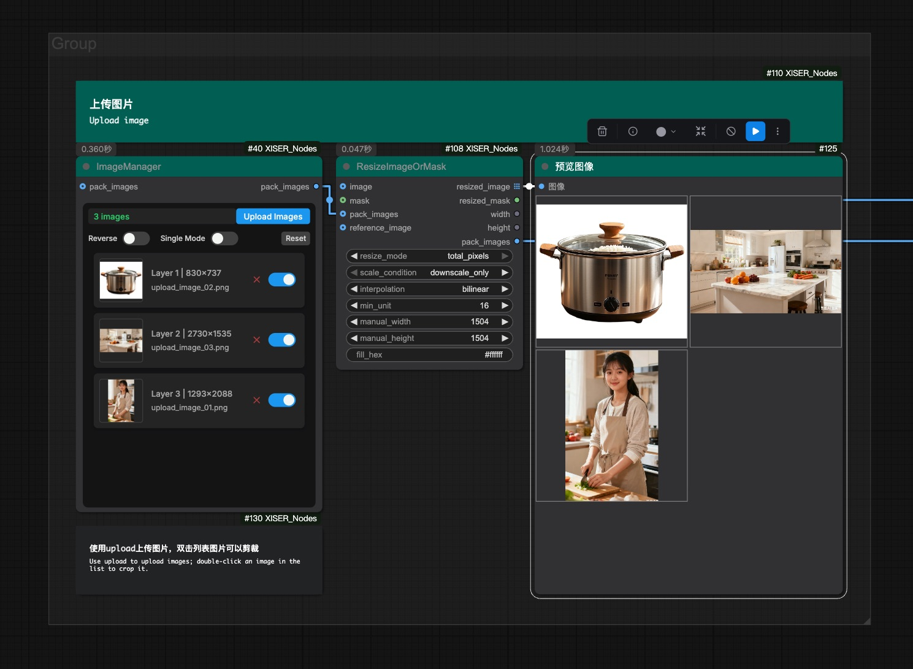
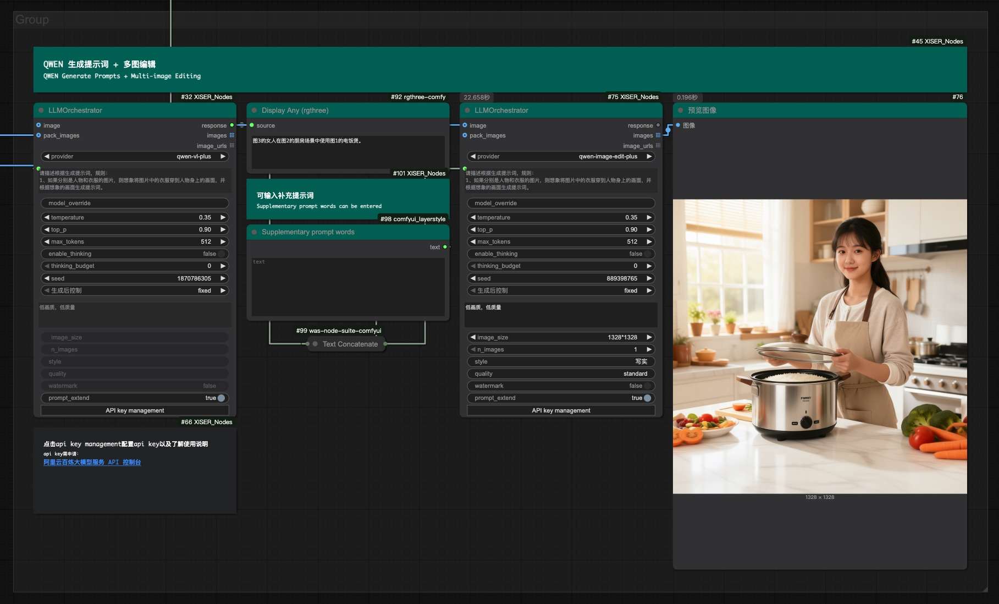
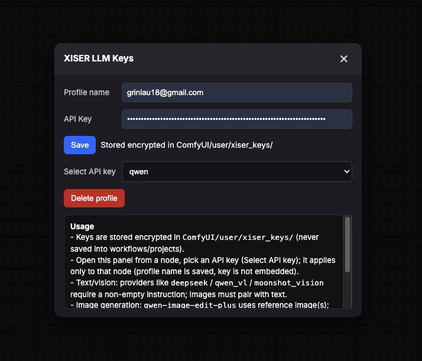
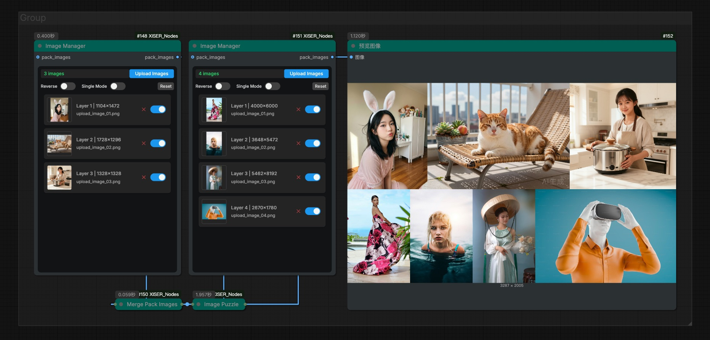
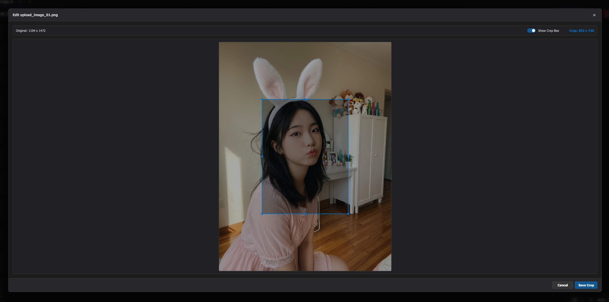
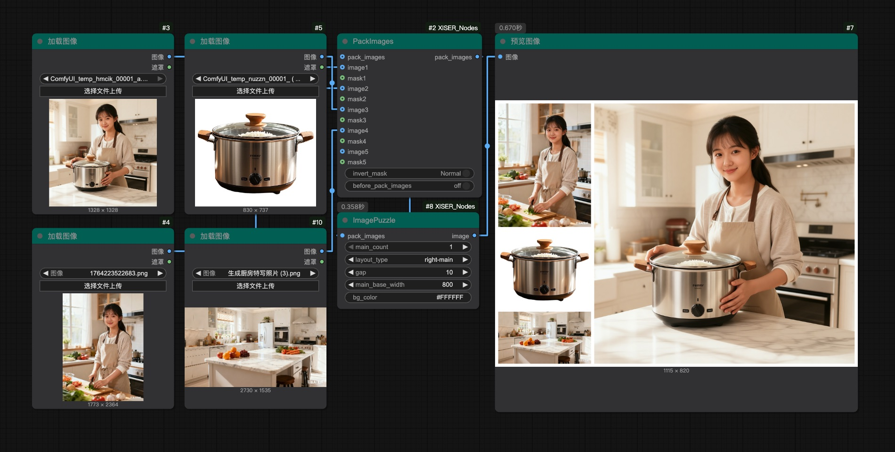
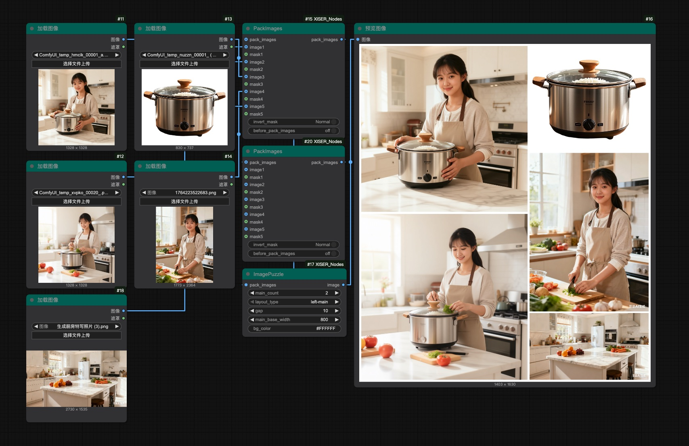

# ComfyUI_XISER_Nodes

<div align="center">

🌐 **Language Selection / 语言选择**

[**English Documentation**](README.md) • [**中文文档**](README_CN.md)

</div>

## 📢 最新更新 (2026年1月)

- **[项目更新说明](UPDATE_SUMMARY_2026.md)** - 完整的更新内容和迁移指南

### 2026年1月更新
✅ **V3架构迁移** - 后端全面采用ComfyUI最新API标准
✅ **新增3个核心节点** - `image preview`、`dynamic pack images`、`dynamic image inputs`
✅ **删除冗余节点** - 移除与`image manager`功能重叠的`reorder images`节点
✅ **LLM Orchestrator增强** - 新增Wan 2.6模型支持，提供图像编辑和图文混排模式
✅ **性能优化** - 改进节点交互和系统性能

---

欢迎使用 **ComfyUI_XISER_Nodes**，这是一个基于 **ComfyUI V3架构** 开发的综合性自定义节点包。
此扩展集成了交互式多层画布编辑、多模态大语言模型智能处理、专业级图像处理工具链以及可视化数据工具，为从创意构思到精细编辑的AI图像生成工作流提供端到端支持。凭借先进的PSD导入、BiRefNet智能抠图、实时图层变换和安全的API密钥管理，它显著提升了创作效率和输出质量。此外，它还提供节点颜色管理和标签节点等工作流自定义功能，以改善复杂工作流的视觉组织和个性化程度。

## 🚀 核心特性

- **🎨 专业级画布编辑** - 交互式多层画布支持PSD导入、BiRefNet抠图、实时图层变换与20步历史管理
- **🤖 多模态LLM集成** - 内置DeepSeek、Qwen、Kimi等大模型，支持图像输入和安全的API密钥管理
- **📊 可视化数据工具** - 曲线编辑器、坐标路径、多点渐变等高级可视化工具
- **🛠️ 图像处理套件** - 完整的图像调整、裁剪、缩放、拼接和蒙版处理工具链
- **🎯 工作流增强** - 形状数据管理、信号检测、简写序列化等数据流优化工具
- **🌈 界面定制** - 节点颜色管理、文本标签、智能滚动条等UI增强功能

## 安装

**通过 ComfyUI 管理器安装**

1. 打开 ComfyUI 管理器
2. 搜索 `ComfyUI_XISER_Nodes` 并安装

**手动安装**

1. 将此仓库克隆到 ComfyUI 安装目录的 `custom_nodes` 文件夹中：
   ```bash
   git clone https://github.com/grinlau18/ComfyUI_XISER_Nodes.git
   ```
2. 在 `ComfyUI_XISER_Nodes` 目录中运行：
   ```bash
   pip install -r requirements.txt
   ```
3. 重启 ComfyUI 以加载新节点
4. 在 ComfyUI 界面的 `XISER_Nodes` 类别下查找节点

**依赖项**：需要 `torch`、`PIL`、`numpy`、`opencv-python` 和 ComfyUI 核心库。

## ⚡ 快速开始

### 1. 基础工作流示例
安装完成后，在ComfyUI界面中搜索 `XISER` 类别，您将看到所有可用的节点。建议从以下核心节点开始：

- **XIS_Canvas** - 创建交互式画布，导入PSD文件进行图层编辑
- **XIS_ImageManager** - 管理图像上传和预览
- **XIS_LLMOrchestrator** - 配置LLM API密钥，开始使用大模型功能

### 2. 第一个工作流
1. 添加 `XIS_Canvas` 节点到工作区
2. 点击节点上的 "Open Canvas" 按钮打开画布界面
3. 上传图像或导入PSD文件
4. 使用画布工具进行图层编辑
5. 连接输出到其他ComfyUI节点进行进一步处理

### 抠图模型配置
画布中的新抠图功能依赖 BiRefNet 蒙版模型，按以下步骤安装：

1. 下载 `BiRefNet-general-epoch_244.pth` 检查点，并放入 `ComfyUI/models/BiRefNet/pth/`。可使用以下镜像：
   - https://pan.baidu.com/s/12z3qUuqag3nqpN2NJ5pSzg?pwd=ek65
   - https://drive.google.com/drive/folders/1s2Xe0cjq-2ctnJBR24563yMSCOu4CcxM
2. 在 ComfyUI 所在环境中安装推理依赖：`pip install kornia==0.7.2 timm`
3. 重启 ComfyUI，画布上的抠图按钮即可调用 BiRefNet 并将带透明区域的结果保存在界面与输出中。

## 核心能力
- 多图层画布编辑，支持 PSD 导入、BiRefNet 抠图、图层变换与蒙版历史管理。
- 可视化节点套件包含曲线/路径/渐变编辑器、图像管理、形状/文本生成、节点配色与标签助手。
- 图像/蒙版/文件工具涵盖调色、裁剪、缩放、重新排序、镜像与 PSD 图层处理。
- 数据与工作流支持包括形状摘要、信号检测、简写序列化、列表抽取与可整除尺寸修正。
- 借助 DeepSeek 的 LLM 自动化能力，配合可扩展的提供方接口，后续可无缝接入更多大模型。

### 🖼️ 多图层画布枢纽（XIS_Canvas）
- **精华**：集成 BiRefNet 抠图、PSD 导入、图层变换、蒙版生成、透明度调节与 20 步历史的主控画布。
- **亮点**：
  - 拖拽、缩放、旋转、显隐、叠放与 Alt+滚轮旋转，实时预览画布中每一层。
  - 支持亮度、对比度、饱和度和透明度实时调整。
  - 支持自定义画布尺寸、边框、背景、自动适配、显示缩放以及滚动内容的自定义滚动条，长内容依然流畅可读。
  - BiRefNet 抠图、蒙版生成和 PSD 多图层提取紧密衔接，XIS_CanvasMaskProcessor 保持蒙版与画布状态同步。
  - 只需一键即可输出带透明层的剪裁结果，省去手动裁切流程。

#### 节点界面

#### 导入PSD进行区域重绘的工作流示例

#### 图像分层排版后进行区域重绘的工作流示例


### 🤖 LLM 自动化桥（XIS_LLMOrchestrator）
- **用途**：将指令以及可选的 `image` / `pack_images` 张量发送给所选 LLM 提供方（目前内置 DeepSeek、Qwen系列、Kimi模型、Wan 2.6等，后续会增加更多模型），输出下游节点可直接读取的 STRING 文本。
- **输入**：
  - **核心参数**（始终显示）：提供者选择、指令文本、随机种子、图像尺寸、模式（wan2.6专用）
  - **高级参数**（可折叠）：温度、Top-P、最大Token数、负面提示词、水印、提示词扩展等
  - **视觉输入**：可选的 `image`（单张）和 `pack_images`（多张）输入
- **UI优化**：
  - **可折叠高级设置**：不常用参数默认隐藏，点击"显示高级设置"展开
  - **界面更简洁**：移除未使用的style和quality参数，界面更清晰
  - **wan2.6模式优化**：模式控件始终显示，水印和提示词扩展移至高级设置
- **附件处理**：节点会自动把所有输入图像转成 PNG Base64 字符串，根据模型上限自动截断，方便在一个请求中附带多张图。
- **扩展性**：提供者通过轻量配置 + 接口注册，即可新增更多模型或自建推理端点，而无需改动节点核心逻辑。
- **视觉输入支持**：
  - **Qwen系列视觉模型**：支持图像输入和视觉理解，但不生成图像
  - **Qwen图像生成模型**：支持图像输入并生成新图像
  - **Wan 2.6图像模型**：支持图像编辑和图文混排模式
  - **DeepSeek模型**：目前不支持图像输入，如果连接了图像输入，会自动忽略图片并添加提示信息
- **Wan 2.6 图像编辑**：新增 Wan 2.6 模型支持，提供专业的图像编辑功能，支持图像尺寸调整、提示词扩展、水印控制等高级参数。
- **图文混排模式**：Wan 2.6 模型支持图文混排（interleave）模式，可在同一请求中交替处理文本和图像内容，实现更灵活的创作流程。
- **API Key 管理**：
  - **安全存储**：API Key 使用加密方式存储在 `ComfyUI/user/API_keys/` 目录中，不会保存在工作流或项目文件中
  - **密钥管理器**：点击节点上的 "API key management" 按钮打开密钥管理界面
  - **配置文件**：支持创建多个 API Key 配置文件，每个节点可以独立选择配置文件
  - **操作流程**：
    1. 点击 "API key management" 按钮打开密钥管理器
    2. 在 "API Name" 输入配置名称，在 "API Key" 输入 API Key
    3. 点击 "Save" 保存加密的 API Key
    4. 在 "Select API key" 下拉菜单中选择要使用的配置文件
    5. 配置将自动应用到当前节点
  - **注意事项**：API Key 配置文件是节点级别的，不同节点可以使用不同的 API Key
  
  
  

### ✨ 可视节点工具包
- **XIS_CurveEditor**：编辑 INT/FLOAT/HEX 曲线，提供可调的贝塞尔点以及 HSV/RGB/LAB 颜色插值。
  - 输出标量序列及可选的彩色列表，以便下游节点复用数值斜坡或调色提示。
    
  

- **XIS_CoordinatePath**：绘制线性或曲线路径，可设置段数、分布模式，并直接导出 x/y 坐标与百分比进度列表。
  - 曲线模式通过带虚拟端点的 Catmull-Rom 样条生成平滑轨迹，线性模式支持均匀或缓动间距。
  

- **XIS_MultiPointGradient**：使用 IDW、径向、Voronoi、软 IDW 或线性插值从控制点生成渐变图像。
  - 后端计算像素权重或 Voronoi 区域，输出可直接用作蒙版、背景或纹理填充的 torch 张量。
  

- **XIS_ImageManager**：管理并重排上传图像，最终输出带预览的 `pack_images`。
  - 记录启用状态、上传顺序、缩略图、确定性 ID 与元数据，确保下游节点看到一致的图像包。
  - **图像编辑**：点击任意预览图可打开内置图像编辑器进行裁剪和调整
  - **视觉提示**：鼠标悬停在预览图上会显示剪刀图标，提示可进行编辑操作
  
  

- **XIS_ShapeAndText**：生成形状或文本蒙版，支持填充/描边、透明度以及 `shape_data` 批量输入；返回形状图、蒙版与背景。
  - 支持圆、多边形、星、心、花、螺旋、太阳爆发与文本（可加载本地字体），并可调节字距/行距、描边、变换与倾斜。
    
  

- **changeNodeColor**：可独立修改节点标题与内容的颜色，提升大型流程可读性。
  - **访问方式**：右键点击任意节点，从上下文菜单中选择 "XISER 节点颜色管理"
  - **颜色选择**：通过颜色选择器选择十六进制颜色，或从预设配色中选择
  - **双色控制**：独立调整标题背景和内容区域背景颜色
  - **主题支持**：在亮色和暗色主题预设之间切换
  - **预设管理**：保存自定义配色组合以便重复使用，删除不需要的预设
  - **批量操作**：选中多个节点可同时对所有选中节点应用颜色
  - **实时预览**：调整颜色时立即应用到节点，无需确认
  - **持久化存储**：自定义预设保存在 `web/xiser_color_presets.json` 文件中
  

- **XIS_Label**：双击编辑 HTML/Markdown，切换编辑器、调整背景与文本缩放，并享受统一段距、列表重新换行与智能滚动条。
  - Markdown 支持标题、列表、加粗/斜体、行内代码与链接，解析后渲染出一致的段落与滚动行为。
  

### 🧰 图像、蒙版与文件节点
- **XIS_ImagePuzzle**：高级图像拼接功能，支持四种布局类型（左主右副、右主左副、上主下副、下主上副），多张主图支持正确间距和对齐。 
  
  
  
- **XIS_ImageAdjustAndBlend**：调节亮度/对比/饱和/色相、RGB 增益与混合模式，可混入蒙版和背景。
- **XIS_CropImage**：使用蒙版裁剪，支持蒙版反转与背景色填充，并可设定边距。
- **XIS_ResizeImageOrMask**：多种缩放策略（强制、等比、画布限制）与插值器，支持只放/只缩等条件。
- **XIS_ReorderImageMaskGroups**：最多 5 组图像/蒙版对，支持插入与重新排序。
- **XIS_InvertMask**：一键切换蒙版正负向。
- **XIS_ImageMaskMirror**：沿 X/Y 轴镜像图像与蒙版，保持布局对称。
- **PSD Layer Extract / XIS_ReorderImages**：提取 PSD 图层并排序，辅助图像批量处理。

### ⚙️ 数据与工具助手
- **XIS_ShapeData**：收集位置、旋转、缩放、倾斜、颜色等形状属性，供后续节点复用。
- **XIS_IsThereAnyData**：检查整数/浮点/布尔信号是否存在，没有时返回默认。
- **CreatePointsString**：将六组帧与强度串成多行 shorthand，方便在提示词或蒙版中复用。
- **XIS_FromListGet1…**：从列表中取出单个 Mask/Image/Latent/Conditioning/Model/Color/String/Int/Float。
- **XIS_ResizeToDivisible**：将尺寸修正到可整除格，适配下游需求。

## 致谢

- 交互画布部分基于 [Konva](https://konvajs.org/) 构建，感谢 Konva 团队提供稳定的 2D 图形 API。
- 抠图功能依赖 [BiRefNet](https://github.com/tamzi/bi-ref-net)，感谢原作者与 tin2tin/2D_Asset_Generator 社区项目，并同时使用 `kornia` 与 `timm` 的推理支持。
- 感谢 ComfyUI 与社区中所有自定义节点作者对多图层画布、历史记录等功能的持续投入。

---

## 联系与资源

**工作流分享**
https://openart.ai/workflows/profile/grinlau?tab=workflows&sort=latest

**Bilibili空间**
https://space.bilibili.com/123365258

**联系方式**
QQ: 3861103314
Email: grinlau18@gmail.com

## 贡献

欢迎贡献！您可以：
- 提交包含新功能或错误修复的拉取请求
- 为建议或问题开启议题

## 许可证

本项目采用 [MIT 许可证](LICENSE)。

---
